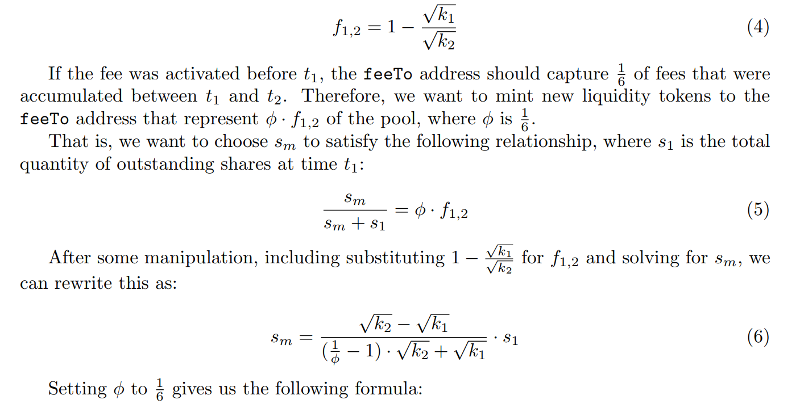
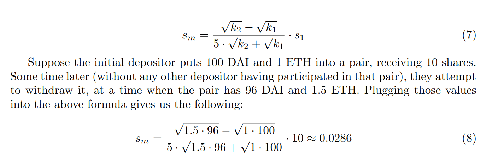

# mini-dex

Just my mini-dex implementation inspired by UniswapV2. Code is untested and should not be used in any commercial project due to possible vulnerabilities. End goal was to learn how UniswapV2 works and create dex with pools that could work without any external contract, so you could interact directly with every single pool. It's not gas efficient, but I wanted to practice my solidity skils and didn't want to just write another Uniswap.

Docs:
https://typicalhuman.github.io/mini-dex/src/Pool.sol/contract.Pool.html

## Tools used
- Solidity
- Foundry
- Slither
- Aderyn

## External contract libraries:
- Openzeppelin
- Solady

## Protocol Fee note

The formula for (1/6 protocol fee).

